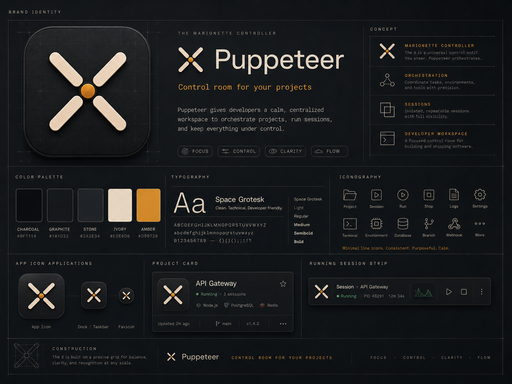

# Puppeteer

Puppeteer is a focused Windows project hub. Point it at the folders where you keep your code, and it discovers every project underneath, groups them by what they are and what they're for, and lets you open persistent terminals in the right working directory without hunting through Explorer.



Built with **.NET 10** and **WPF**.

## Features

**Discovery**
- Recursive root scanning that prunes generated/heavy directories (`node_modules`, `bin`, `obj`, `.git`, …).
- Stack detection for Tauri, .NET/WPF, Flutter, Next.js, Vite/React, Node.js, Qt, Android/Kotlin, Rust, Python, and Godot — with a primary framework, the full technology list, and suggested commands.
- Rescan all roots at any time (toolbar button or `Ctrl+R`).

**Organizing**
- Three independent filters: **Type** (Desktop / Website / Mobile / Game), **Technology**, and **Category** (Personal / Client / Hackathon / Course / Work).
- Category is inferred from the folder path, and optionally refined by an LLM (Groq) that reads each project's README — see [AI categorization](#ai-categorization).
- A folder-tree in the sidebar scopes the grid to any subtree.
- Full-text search across name, path and stack, plus sort by name, most-recently-opened, or type.
- Pin the projects you touch most to the top of the grid.

**Working**
- Interactive terminals backed by real processes, opened in the project's directory. Type commands, run detected presets, split panes to see several shells at once, or go fullscreen.
- Stop, restart, clear and copy per session; the terminal panel is resizable and collapsible.
- Open a project in Explorer or your IDE, or copy its path.
- Live Git status: a dot on every card with uncommitted changes, refreshed in the background after each load, and the branch plus changed files in the inspector.

**Documenting**
- Connect a **docs folder** — one markdown doc per project, holding what it is, what works, what's broken, and what comes next — and Puppeteer matches each doc to a project and shows the two side by side.
- The folder is expected to be edited from outside. Puppeteer reloads when a doc changes underneath it, and refuses to save over an edit it hasn't seen rather than overwriting it.
- Matching survives folders being moved and renamed: exact path, then folder name, then the doc's own names (its title, its file name, and anything in an `Aliases:` field). A near-miss is offered for one click, never applied on its own. A doc describing a folder that holds several repos covers all of them.
- The **Docs** page ranks by what needs attention and spells out the drift: location moved, stack no longer matches, newer commits than the doc, empty sections, plus live repo facts — uncommitted work, unpushed commits, parked on a branch.
- **Sync facts** rewrites only `Location`, `Stack` and `Last activity` from the repo, for one doc or every linked one. Prose sections are yours and are never touched.
- Edit a doc's status and its five sections straight from the inspector, or open the file in your editor.
- **Read** any project's state doc, its own README, or the index itself, rendered in the app — headings, lists, tables, code and links.
- Connect the **projects index** too: the one markdown file that lists everything. Puppeteer takes each row's archived/paused marker and one-line summary from it, and uses its links to find docs whose folder has since been renamed.
- Grid or list, a search box, a state filter, and a section filter drawn from the index's own headings.
- A **state history** records each project's branch, head commit and uncommitted count after every git refresh — a row only when something actually changed.

**Living in the tray**
- A notification-area icon that reports how many sessions are live, with Open, New terminal and Quit.
- Minimize and/or close to the tray instead of quitting; a warning before quitting stops running terminals.
- Start with Windows via the per-user Run key — no elevation, revocable from Task Manager's Startup tab — optionally straight to the tray.

**Slice-of-life**
- Grid and list views: cards for browsing, compact rows for scanning a long library.
- Resizable, collapsible sidebar / details panels; the app remembers your window size, panel widths, view, sort and last page.
- Keyboard: `Ctrl+K` search, `Ctrl+N` new terminal, <code>Ctrl+&#96;</code> toggle terminal, `Ctrl+R` rescan, `Esc` clear/close. Shell bindings win while the caret is in a terminal.
- Ranked project-icon discovery across common asset folders, without touching project files.
- Everything (roots, projects, icons, presets, pins, preferences) persists in a local SQLite database.

## Settings

- **Roots** — add and remove the folders Puppeteer scans.
- **Startup & notification area** — launch with Windows, start hidden, minimize to tray, close to tray.
- **Terminal** — default shell, scrollback depth, whether to confirm quitting with sessions running.
- **Appearance** — comfortable or compact card density.
- **Tools** — an Open-in-IDE command (`code`, `rider`, `subl`), or leave it blank for the shell default.
- **Project docs** — the folder of per-project state docs, the projects index, and whether to keep a state history.
- **AI categorization** — see below.
- **Data** — reset the window layout, or open the folder holding the database.

## AI categorization

Categorizing a project as *personal*, *client*, *hackathon* or *coursework* is done first from the folder path, and — when a key is available — refined by Groq's API using the project's README.

- **Development:** copy `.env.example` to `.env` and set `GROQ_API_KEY`.
- **Anywhere:** paste a key into **Settings → AI categorization**; it overrides the `.env` value and is stored locally.

Without a key, the path-based heuristic is used on its own.

## Project docs

Point **Settings → Project docs** at a folder of markdown docs, one per project — for example `D:\Programming\Resources\Projects`. The shape Puppeteer reads and writes is:

```markdown
# Hive

**Location:** D:\Programming\Desktop\Tauri\Personal\Hive
**Category:** Desktop (Tauri)
**Client or personal:** Personal
**Status:** Active
**Stack:** Tauri 2 + Rust, React 19, SQLite

## Summary
## What works
## What's broken / incomplete
## Next steps
## Notes
```

Only `Status` is Puppeteer's own addition, and it is optional; everything else is read if present and left alone if not. Fields and sections it doesn't recognise keep their place, and a markdown file with neither a title nor a header field is treated as a stray and never rewritten.

Docs are matched to projects automatically. When a doc's name no longer matches its folder, record the other names in it:

```markdown
**Aliases:** FOLIO, Follio
```

## The index

The second half of the setup is the single markdown file that lists every project and links to its doc — `projects.md` beside the docs, unless **Settings → Project docs → Projects index** points elsewhere. Rows look like this:

```markdown
## Web
| Project | Location | Client | Summary |
|---|---|---|---|
| [Cosmetocare](Web/Cosmetocare.md) | `Web\Personal\Cosmetocare` | Personal | Ingredient safety platform. |
| **[ARCHIVED]** [HackatonBackend](Web/HackatonBackend.md) | *(no longer on disk)* | Hackathon | RAG chatbot API. |
```

Puppeteer reads three things from it and writes none:

- **Which doc belongs to which project.** This is the only thing that finds a doc after its folder was renamed — Follio's doc is still `PrivateSchool.md`, Pharma-Touch's is still `Ordonance.md`. There is no alias table in the app; the index is the alias table.
- **The bracketed marker** — `**[ARCHIVED]**`, `**[PAUSED]**` — as the project's status, for the many docs that carry no `Status` field.
- **The row's summary and section**, which stand in for a project with no doc and drive the section filter.

It is mostly hand-written prose with tables in it, so the parser takes only what is unambiguous and skips the rest rather than guessing.

## Matching, in order

1. A link you made by hand.
2. A doc whose `Location` is the project's exact folder.
3. What the index says.
4. The doc's `Location` ending in the same folder name.
5. The doc's own names — title, file name, `Aliases`.
6. A doc describing a folder the project sits inside, which covers every repo in it.

A near-miss on a name is never applied; it is offered as one click.


## Running

```bat
run.bat
```

Requires the .NET 10 SDK. The script closes any running instance before rebuilding.

## Project layout

- `src/Puppeteer.Core` — domain models, detection, classification and search (no UI dependencies).
- `src/Puppeteer.Infrastructure` — scanning, SQLite persistence, terminals, Git, and the Groq classifier.
- `src/Puppeteer.App` — the WPF application (MVVM).
- `tests/Puppeteer.Core.Tests` — unit tests for the core logic.
