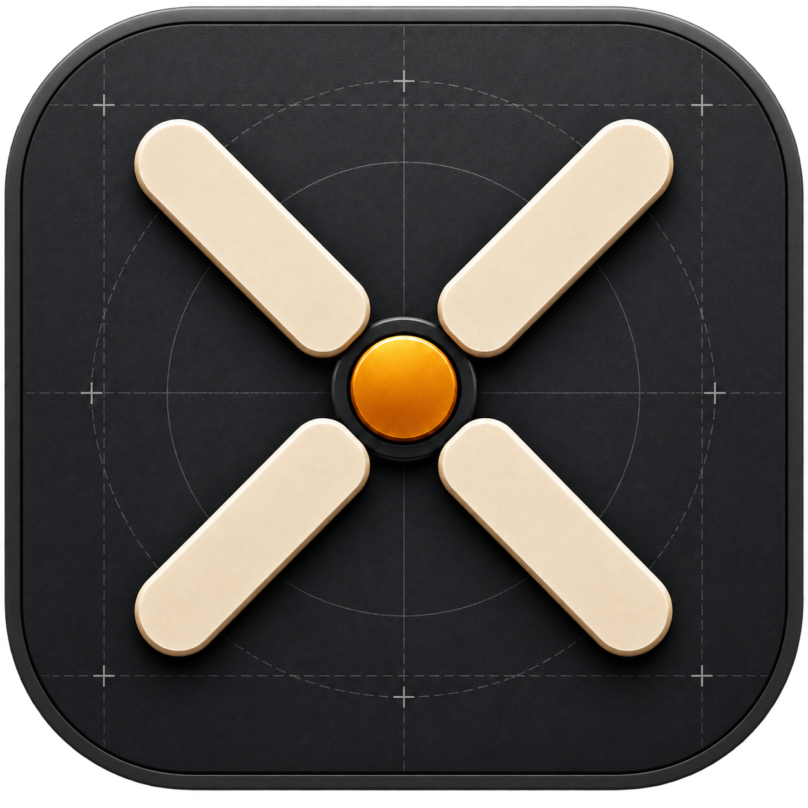

<h1 style="font-family: Arial, sans-serif; font-size: 36px; color: #F0B24A; display: flex; align-items: center; gap: 12px; border-bottom: 3px solid #F0B24A; padding-bottom: 8px;">
  
  Puppeteer: Project Hub for Windows
</h1>

**Puppeteer** is a focused Windows project hub for people with more repositories than browser tabs. Point it at the folders where you keep your code and it discovers the projects underneath, recognizes their stack, keeps their state docs close, and opens persistent terminals in the right working directory. Built with **.NET 10, C#, WPF, and SQLite**.

Browse a library as cards or a compact list, filter it by type, technology, category, and state, then pick up exactly where you left off without hunting through Explorer.

---

## Tech Used


## Screenshots

### Project library

Browse discovered projects in a responsive card grid or compact list, with filters, search, folder navigation, pinned projects, Git status, and an inspector for the selected project.


### Persistent terminals

Open real shell sessions directly in a project's folder. Run detected presets, split the terminal panel, restart or stop sessions, and keep several projects close at hand.


### Project docs

Connect a folder of Markdown state docs and a projects index. Read, edit, link, and keep project facts in sync without replacing your own prose.


### Settings

Configure scan roots, startup and tray behavior, terminals, appearance, tools, docs, AI categorization, and local data from one place.


## Features

- **Discovery:** recursively scan project roots while skipping generated and heavy folders such as `node_modules`, `bin`, `obj`, and `.git`.
- **Stack detection:** recognize Tauri, .NET/WPF, Flutter, Next.js, Vite/React, Node.js, Qt, Android/Kotlin, Rust, Python, and Godot projects; surface their technology list and likely run commands.
- **Organizing:** filter independently by project type, technology, category, and state; search by name, path, or stack; sort by name, recent activity, or type; and pin frequently used projects.
- **Terminal workspace:** create interactive terminal sessions in the selected project's directory, with presets, splitting, fullscreen, and per-session stop, restart, clear, and copy actions.
- **Git awareness:** see uncommitted-change indicators in the library and branch / changed-file details in the inspector, refreshed in the background.
- **Project docs:** pair projects with Markdown docs, edit their status and sections in the app, render docs and READMEs, and sync repository facts without rewriting your notes.
- **Projects index:** read a hand-maintained Markdown index for summaries, sections, states, and durable doc links when folders are renamed.
- **Thoughtful Windows behavior:** notification-area controls, optional close/minimize-to-tray, launch at sign-in, remembered layout preferences, and keyboard shortcuts.
- **Local-first storage:** roots, project metadata, pins, presets, preferences, and history are stored locally in SQLite.

## Requirements

- **Windows 10 or Windows 11**
- **.NET 10 SDK** to build and run from source

## Install the Windows release

Download `Puppeteer-0.7.2-win-x64-setup.msi` and run it. The installer requests administrator
permission because it installs Puppeteer for all users under `C:\Program Files\Puppeteer`. It adds
Puppeteer to the Start Menu and Desktop, and includes its own .NET runtime, so no separate .NET
installation is required.

If startup fails, Puppeteer displays the error and writes the full diagnostic details to
`%LOCALAPPDATA%\Puppeteer\startup-error.log`.

## Run from source

```bat
git clone https://github.com/mohaneddz/Puppeteer.git
cd Puppeteer
run.bat
```

`run.bat` closes a running Puppeteer instance before starting the application so the build output is available.

Or use the .NET CLI directly:

```powershell
dotnet run --project src/Puppeteer.App/Puppeteer.App.csproj
```

## Test

```powershell
dotnet test
```

The core test suite covers project detection, classification, linking, and launch behavior.

## Project docs

Puppeteer can connect a folder of one-Markdown-file-per-project state docs. Set its location in **Settings → Project docs**. A document can look like this:

```markdown
# Hive

**Location:** D:\Programming\Desktop\Tauri\Personal\Hive
**Category:** Desktop (Tauri)
**Client or personal:** Personal
**Status:** Active
**Stack:** Tauri 2 + Rust, React 19, SQLite

## Summary
## What works
## What's broken / incomplete
## Next steps
## Notes
```

Puppeteer only manages the facts it owns: `Location`, `Stack`, `Last activity`, and optionally `Status`. It leaves unfamiliar fields and every prose section intact. If a project or doc has been renamed, add an alias to the doc:

```markdown
**Aliases:** FOLIO, Follio
```

Optionally, connect a Markdown projects index too. Puppeteer reads its unambiguous table rows for project summaries, sections, archived or paused state, and doc links; it never writes to the index.

```markdown
## Web
| Project | Location | Client | Summary |
|---|---|---|---|
| [Cosmetocare](Web/Cosmetocare.md) | `Web\Personal\Cosmetocare` | Personal | Ingredient safety platform. |
| **[ARCHIVED]** [HackatonBackend](Web/HackatonBackend.md) | *(no longer on disk)* | Hackathon | RAG chatbot API. |
```

## AI categorization

Project category is inferred from the folder path first. With a Groq API key, Puppeteer can additionally read a project's README to refine whether it is personal, client, hackathon, or coursework.

For development, copy `.env.example` to `.env` and set `GROQ_API_KEY`. You can also paste a key in **Settings → AI categorization**; that local setting takes precedence. Without a key, Puppeteer uses the path-based heuristic only.

## Project structure

| Project | Responsibility |
|---|---|
| `Puppeteer.Core` | Domain models, project detection, classification, search, and Markdown parsing/linking without UI dependencies |
| `Puppeteer.Infrastructure` | Root scanning, SQLite persistence, terminal processes, Git integration, docs storage, and Groq integration |
| `Puppeteer.App` | WPF interface, view models, controls, app settings, startup, and notification-area integration |
| `Puppeteer.Core.Tests` | Tests for core discovery, detection, linking, and launch behavior |

## Settings and local data

Puppeteer stores its database and preferences locally. No account or hosted service is required. The Settings window lets you manage scan roots; startup, tray, terminal, and appearance behavior; IDE commands; docs and index connections; AI categorization; and data-folder access.

The only optional network feature is AI categorization through Groq when you choose to configure it.
